# FTC Pitfund v2 · QA report

Prompt 4 (launch polish and QA), finished 2026-09-15 on branch `rebuild`. This report records what was
checked, how, what was fixed and what was accepted, and proves every acceptance criterion in
[plan §12](../prompts/rebuild/00-REBUILD-PLAN.md#12-acceptance-criteria-the-rebuild-is-done-only-when-all-are-true).
Every number below comes from a command in this repository; re-run it to reproduce it.

## How to reproduce

```bash
npm install && npm run setup          # Docker is the only prerequisite
npm run check                         # typecheck · lint (0 warnings) · Vitest
npm run build
npm run e2e                           # Playwright journeys (dev :3000 + production build :3100)
npm run qa                            # the UX gate: demo, edge, empty × personas × 375/768/1280
npm run perf                          # bundles · Lighthouse · queries and render time · action latency
npm run qa:clicks                     # dead-click audit
npm run security:scan                 # secrets in build output · REST lockdown · /dev · non-goals
npm run knip && npm audit --omit=dev --audit-level=high
npm run email:preview                 # every template through Mailpit at 600 and 375 px
```

The final proof run was made from a **fresh clone in a temporary directory** (section 10).

---

## 1. What was checked, and how

| Area | How | Result |
| --- | --- | --- |
| Every route × persona × width | `npm run qa` (`tests/qa/qa.spec.ts`, routes in `tests/qa/routes.ts`) on `demo`, `edge` and `empty`: HTTP status and redirects, console/network/page errors, horizontal scroll, text overflowing its box, axe serious/critical after animations settle, every dialog/sheet/popover (width, fits viewport, sticky close, focus trap, Esc, focus return), TTFB/LCP/CLS on the production build, ActionButton pending ≤ 100 ms, soft 404s | 582 checks, 0 failures |
| Screenshots | Every image in `qa/screens/` opened and judged against plan §7; long pages cropped with element screenshots | Findings fixed (section 2) |
| State machines (§3.2) with fault injection | E2E journeys plus `pitfund-simulate` cookie, `page.route` aborts and CDP network throttling | Matrix in section 3 |
| Dead clicks | `npm run qa:clicks` (`tests/qa/dead-clicks.ts`): every visible button, tab and summary on every production route, each on a fresh load, must cause a DOM change, focus move, scroll, navigation, router or action request, file chooser or dialog within 150 ms; every link must go somewhere | 0 findings |
| Keyboard only | `tests/e2e/keyboard-journeys.spec.ts` (sign-in, coach composer, company response) and the admin review in `tests/e2e/sponsor-admin.spec.ts` | Section 4 |
| Phone (375 px) usability | `tests/e2e/mobile.spec.ts`: composer, admin review, company inbox, PDF viewer, driven with taps on a touch device | Section 5 |
| Email templates | `npm run email:preview`: each template (and a long-content variant) rendered, sent through SMTP to Mailpit, checked for HTML + plain-text parts, sender, absolute links, URLs on their own lines in text; screenshotted at 600 and 375 px and checked for overflow | All templates pass; images in `qa/emails/` |
| Performance | `npm run perf` (budgets in `tests/qa/routes.ts` `BUDGETS`, failures exit 1 in CI) | Section 6 |
| Security | `npm run security:scan`, `tests/unit/authz-coverage.test.ts`, `tests/unit/authz.test.ts`, `npm audit --omit=dev` | Section 7 |

---

## 2. Findings fixed (before → after)

Crops are in `docs/qa/`. Each "before" was taken from the build that had the problem, each "after" from the fix.

| Finding | Before | After |
| --- | --- | --- |
| Team invites at 375 px: the email shared a row with Resend and Revoke and broke mid-address ("coach-new@pitfund.t / est"); the actions now sit under the email | 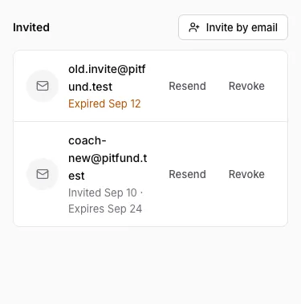 | 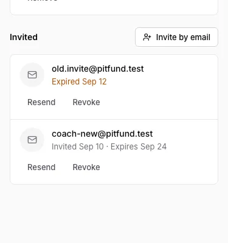 |
| Deck viewer before its pages load (375 px): pages 2+ were flat grey slabs; they are now page-shaped skeletons with faint text lines | 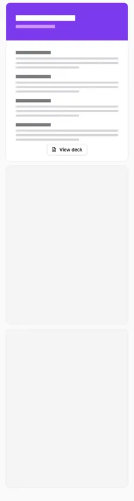 | 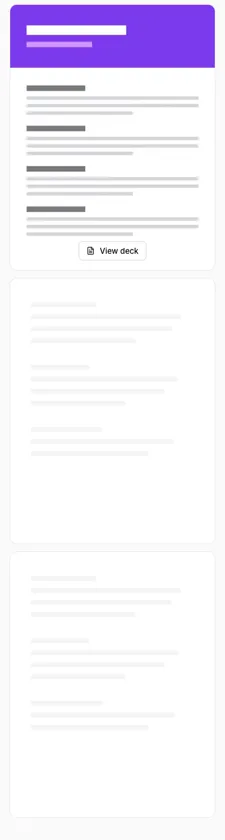 |
| System limits at 768 px: three narrow columns wrapped "13 / 100" and "24 h" and the quota rows; the cards stack until 1024 px | 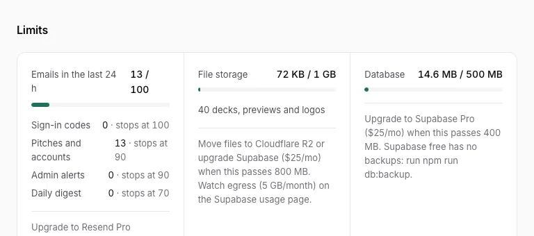 | 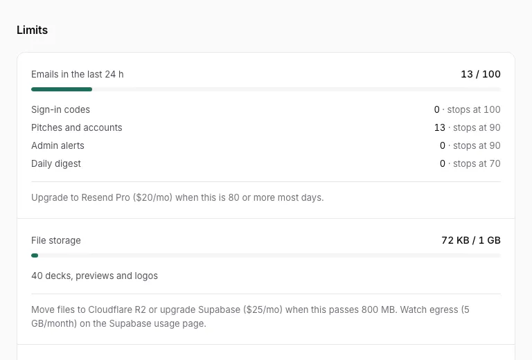 |
| Sponsor directory at 375 px: the status link ("Matched →") was inset from the card text and buttons; it now aligns with them (`-mx-2`) | 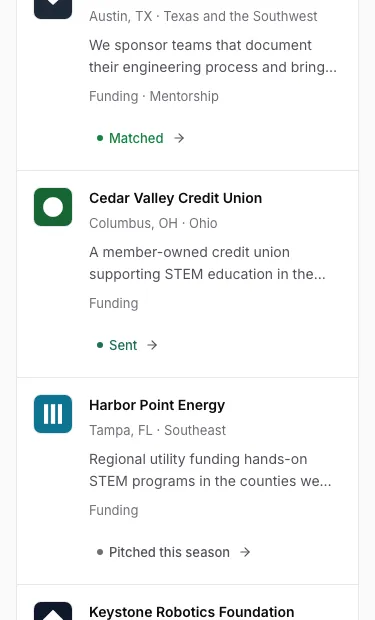 | 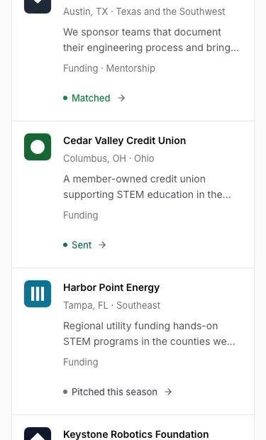 |
| Pitch header at 375 px: the company logo was vertically centred against a three-line header; it now aligns to the title's top | 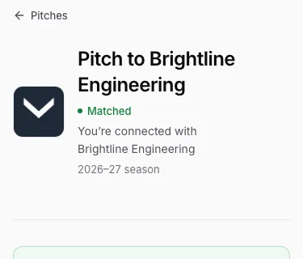 | 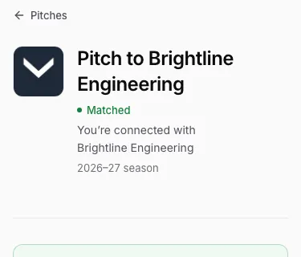 |
| Default questions: "Atlas Components's support" (wrong possessive for names ending in s); now "Atlas Components’ support" (`fillCompany`) | 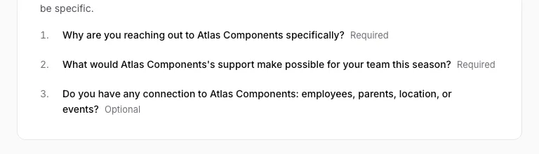 | 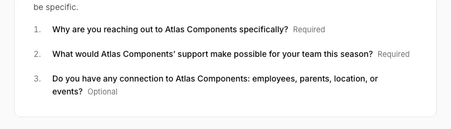 |

Fixed without an image pair (each is now guarded by a test or a gate):

- **Pending company page crashed** ("Event handlers cannot be passed to Client Component props"): a server
  component rendered the client `Button` with an `onClick`. It is now a plain element with `buttonVariants()`;
  covered by the QA route `company-pending` and `tests/e2e/isolation.spec.ts` (pending company banner).
- **Lazy dialogs didn't return focus** after the dialog code was split out of the first-load bundle: dialogs without
  a Radix trigger now restore focus to the element that opened them (`components/ui/dialog.tsx`, `openerRef`). The QA
  overlay check (focus return) and the keyboard specs cover it.
- **Typed email wiped on `/login`** when a Suspense fallback swapped in after hydration: the sign-in page reads its
  query string on the client, so the form never remounts (10 E2E tests caught it).
- **Soft 404s passed silently** in the `empty` scenario (composer routes for seed companies that don't exist there):
  the QA gate now fails any route that renders "We couldn't find that page" unless the route says it expects that.
- **Top bar misaligned on review pages**: wide pages (`/sponsors/[id]/pitch`, `/pitches/[id]`) now widen the top bar
  to the same `max-w-review` column as the content (`lib/shared/nav.ts` `isWideAppPage`).
- **Dead-click audit false positives and true positives**: the composer's "Answer question N" (focus move) and the
  deck's "View deck" (replaced by its loading state) are now recognised as live responses; no real dead clicks remained.
- **Performance regressions found by `npm run perf`**: `/login` shipped zod (242 KB), `/t/[number]` loaded pdf.js before
  the page finished (769 KB), and Radix/Sonner were in every signed-in page. Fixed by moving sign-in helpers out of the
  schema module, loading the PDF pages after `load` + idle, and loading overlays, menus and toasts on first interaction
  (`lib/client/lazy.ts`, `components/ui/dialog.tsx`, `lib/client/toast.ts`).
- **Composer blockers were 20 px tap targets on a phone** ("Answer question 2", "Upload your sponsorship deck"): found by
  `tests/e2e/mobile.spec.ts`; each is now at least 32 px tall.
- **`/login` first paint waited on the stylesheet** (LCP ~2.0 s on Slow 4G): the CSS is inlined and images are AVIF (section 6).
- **Text reflowed when Inter loaded on Linux and Android** (CLS 0.092 on an admin team page with a long name, `edge`
  scenario, CI on `main`). next/font only size-matches `local(Arial)`, so where Arial is missing the page painted in DejaVu Sans
  (Linux) or Roboto (Android), then jumped when Inter swapped in. This was reproduced in Linux Chromium (Playwright's Docker image):
  0.092 with the font delayed. `app/globals.css` now adds calibrated fallback faces for Liberation Sans, Roboto and DejaVu Sans,
  measured from the real font files with the same method next/font uses. The same Linux run now measures 0.001, with
  Liberation present and with DejaVu alone.
- **Times rendered by client components could fail hydration** (React error #418 on the composer in CI). "Saved · 4 min ago"
  was formatted on the server and again in the browser, and the minute can turn in between. Dates also differ by time zone
  (server UTC, visitor local), and the answer counter's `toLocaleString()` differs by browser locale. `components/ui/time-text.tsx`
  renders times as `<time suppressHydrationWarning>` in the composer, join requests, the deck card and the pitch view.
  The counter is pinned to `en-US`.
- **The QA gate flaked on `/dev/ui` in CI** with a hydration mismatch on `caret-color`: Playwright's screenshot hides the
  caret by writing an inline style onto every input, and on a slow runner that happened before React hydrated the page.
  `settle()` (`tests/qa/checks.ts`) now waits until every form control is hydrated.
- **Creating a company** now goes straight to `/company` (profile and questions), so the sign-up path is 4 screens (`app/actions/company.ts`).
- **The seeded deck poster was a near-blank sheet.** `generateDeckThumbnail` was widened to `THUMB_WIDTH_PX`
  (1700 px) without scaling the layout it draws, so the header band and text lines stayed at their 300 px
  coordinates in the corner of a blank page. Every deck card, the team setup page and the public page's first
  paint showed it. The drawing is now scaled with the canvas (`scripts/seed/assets.ts`).
- **The verification screenshot was never deleted.** `/welcome/team` tells a coach "we delete it once you're
  approved", and nothing did. `approveTeam` now clears `proof_path`/`proof_bytes`/`proof_uploaded_at` and returns
  the path so `approveTeamAction` removes the object from the private bucket; the admin page says the screenshot
  was deleted on approval instead of reading as a gap. Covered by `tests/unit/admin.test.ts`.
- **The logo cropper escaped the QA gate.** It opens on a file pick, not from an `[aria-haspopup="dialog"]`
  trigger, so the gate's automatic dialog sweep (focus trap, Esc, focus return, axe, width) never reached it.
  `tests/qa/routes.ts` now opens it as a `team` interaction.
- **Emails in the admin people directory** were truncated to "member-…" at 375 px; they now wrap onto up to two lines (`line-clamp-2 break-all`), and member rows put their actions under the name instead of breaking emails mid-word.

---

## 3. State machines and fault injection (plan §3.2, prompt 4 §C3)

Every branch produces the specified human message and a way forward. "Unit" tests run against the local Postgres in a
rolled-back transaction; "E2E" tests drive a real browser against the dev server or the production build.

| Machine / fault | Branch | Proof |
| --- | --- | --- |
| Sign-in (email code) | wrong code, expired code → "Send a new code", resend cooldown, rate limited with wait time, email can't be sent → offers Google, Google cancel copy, sign out | `tests/e2e/auth.spec.ts` (8 tests, codes read from Mailpit) |
| Sign-in intent | landing doors preselect the `/welcome` branch; a signed-in coach goes home | `tests/e2e/intent.spec.ts` |
| Welcome → team | FIRST records **timeout** (`ftc-timeout`) explains and recovers; not found; team already on Pitfund | `tests/e2e/coach-journey.spec.ts` "failure states", `tests/unit/ftc-records.test.ts` (fallback to FTCScout, outage = unavailable) |
| Deck upload | 8-page PDF, not a PDF, consent required, **storage PUT aborted** → "Upload interrupted." + Retry keeps the file, slowed upload shows stage and progress | `tests/e2e/coach-journey.spec.ts`, `tests/unit/team.test.ts` (magic bytes, foreign receipts refused) |
| Composer | autosave **failure** (`save-draft`) → "Couldn't save. Retry"; changed question set explained; season conflict links to the existing pitch; blockers link to their fix | `tests/e2e/coach-journey.spec.ts`, `tests/e2e/isolation.spec.ts`, `tests/unit/pitches.test.ts` |
| Pitch lifecycle | draft → in_review → changes_requested → resubmitted → sent → matched / declined; withdraw frees the slot; rejected / not a fit keep it | `tests/e2e/sponsor-admin.spec.ts`, `tests/e2e/coach-journey.spec.ts`, `tests/unit/pitches.test.ts`, `tests/unit/admin.test.ts` |
| Admin review **conflict from two contexts** | the second admin is told who decided; nothing changes | `tests/e2e/sponsor-admin.spec.ts` "two admins deciding the same pitch", `tests/unit/admin.test.ts` |
| Company response | Interested snapshots contacts; Not a fit with optional reason; a coworker answered first → conflict | `tests/e2e/sponsor-admin.spec.ts`, `tests/unit/sponsor-side.test.ts` |
| **Withdrawn pitch opened by a company** | read-only notice, no response buttons | `tests/e2e/fault-injection.spec.ts` |
| Team membership | join request approve/decline; invite by email; wrong email refused; **revoked invite** link explains; used/expired/unknown links explain | `tests/e2e/team-membership.spec.ts`, `tests/unit/invites.test.ts`, `tests/unit/team.test.ts` |
| **Owner and editors** | an editor can edit the profile and pitch but can't invite, decide a join request or remove anyone; the owner can't be removed and can't leave without handing the team over; transfer demotes before it promotes, so one owner per org always holds | `tests/unit/team.test.ts` "the owner can't be removed and can't walk away without handing the team over", `tests/unit/authz.test.ts` (`coach-editor` fails `requireTeamOwner`), `tests/e2e/team-membership.spec.ts` |
| **Team review gate** | draft (blockers name what is missing) → sent for review → locked waiting screen → approved, or rejected with a note the team can fix and resubmit; nothing about an unapproved team is reachable, its public page included | `tests/e2e/acceptance.spec.ts` §12 coach, `tests/e2e/shell.spec.ts` (`coach-pending` lands on `/welcome/pending`), `tests/unit/admin.test.ts` "approve and reject are one-shot transitions…" and "a rejected team keeps the note…" |
| Company approval | pending company invisible to coaches **and locked out of its own workspace** until approved | `tests/e2e/sponsor-admin.spec.ts`, `tests/unit/sponsor-side.test.ts` |
| **The bell** | only work is counted — news is stored but never reaches it; acting on an item clears it for everyone on the org, not just whoever clicked | `tests/unit/data.test.ts` "only count work: news is stored but never reaches the bell" and "clear an action item for everyone once the thing it points at is handled", `tests/e2e/feedback.spec.ts` "the bell lists only what needs doing, and an item clears when it is done" |
| **Directory search** | a misspelled company name still finds the company, best match first; below the similarity threshold it says "No companies match"; the pitch-status chips narrow to what this team has and hasn't pitched, and a withdrawn pitch counts as not yet pitched | `tests/unit/directory-and-public.test.ts` "finds companies whose names were typed wrong, best match first" and "narrows the list to what this team has and hasn't pitched", `tests/unit/directory-filters.test.ts` |
| **Logo cropper** | drag and zoom choose the square that is kept; Cancel keeps the old logo; the server still re-checks the bytes it is sent | `tests/unit/logo-crop.test.ts` (the geometry: clamping, zoom, the region that is actually rendered), `tests/e2e/acceptance.spec.ts` (both org kinds pick a file and confirm with "Use photo"), QA gate (the dialog is swept for focus trap, Esc, focus return and axe at every width) |
| Email **Resend 429 / 500** | action still succeeds, System shows the email retrying; transient back-off 1/2/4/8 min, 5 attempts; permanent errors fail at once and can be retried | `tests/e2e/fault-injection.spec.ts` (`email-500`), `tests/unit/outbox.test.ts` |
| **Exhausted email quota** | approval says email is delayed until tomorrow; System shows it queued; auth codes use the full 100 | `tests/e2e/sponsor-admin.spec.ts`, `tests/unit/outbox.test.ts` |
| **Offline mid-action** | "Couldn't reach FTC Pitfund. Check your connection." + Retry recovers | `tests/e2e/feedback.spec.ts` |
| **Slow 3G** | a save acknowledges at once (≈100 ms including Playwright overhead), says what it is doing, and lands | `tests/e2e/fault-injection.spec.ts` |
| Slow navigation | a layout-shaped skeleton shows | `tests/e2e/feedback.spec.ts` |
| Account | edit with validation and in-place success; deletion blocked for a last member; deletion for a person with no team | `tests/e2e/welcome-and-account.spec.ts` |
| Reports, suspension, verification, cron | each transition once; suspended pages hidden; digest once per day; cron safe twice | `tests/e2e/public-team.spec.ts`, `tests/unit/admin.test.ts`, `tests/unit/directory-and-public.test.ts` |

Components' pending, error, empty and long-content states are also on `/dev/ui` and swept by the QA gate at every width.

---

## 4. Keyboard

- **Sign-in, composer, company response:** `tests/e2e/keyboard-journeys.spec.ts`. Every control is reached with Tab
  (never clicked or focused directly); Enter submits, Space checks, arrows move radio choices; the sign-in code field
  takes focus; each "Answer question N" blocker moves focus into its answer; each dialog traps Tab and Shift+Tab, closes
  on Esc or Cancel, and returns focus to the button that opened it. The composer deletes its own draft with the keyboard,
  and the company cancels, so no shared state changes.
- **Admin review:** `tests/e2e/sponsor-admin.spec.ts` "keyboard-only review": `S` and `R` open their note dialogs, `A`
  approves, `J`/`K` move, each decision advances.
- **Shortcuts are documented** on the review page itself (key hints on Approve & send, Send back, Reject and the queue
  arrows at ≥ 1024 px) and in `docs/RUNBOOK.md`.
- **Focus is visible** everywhere: every control uses the `focus-visible` ring from `components/ui`; there is a
  skip link to the main content in `app/layout.tsx`.
- **Accessible names:** axe (`button-name`, `link-name`, `label`, `aria-*`) runs on every route × persona × width and on
  every opened dialog, sheet and popover in the QA gate with zero serious or critical violations. Icon-only controls were
  also reviewed by hand. `IconButton` (`components/ui/icon-button.tsx`) requires a `label` and renders it as `aria-label`;
  the rest set one directly. Each has a specific name: "Needs your attention, N items", "Account menu", "Open menu" / "Close menu" (phone nav), "Close"
  (every dialog and sheet), "Dismiss" (every toast), "Clear search", "Previous page" / "Next page" (PDF viewer),
  "Actions for {name}" (admin directory), "Move question N up" / "Move question N down" / "Delete question N"
  (questions editor), and, in the logo cropper, a labelled "Zoom" slider plus a crop area named "Crop area. Drag to move the image, or use the arrow keys. Press plus and minus to zoom." The skip link
  "Skip to content" is the first Tab stop on every page.

## 5. Phone (375 px)

`tests/e2e/mobile.spec.ts` runs against the production build on a touch device at 375 × 812 and checks that every control used is on screen, at least
32 px tall, inside the viewport and **not covered where a finger lands** (a sticky bar over a button fails):

- **Composer:** the Write / Preview switch works; a blocker tap scrolls to its answer and focuses it; Submit and Delete draft are tappable.
- **Admin review:** Approve & send, Send back and Reject are tappable; the note dialog fits the screen and Cancel closes it.
- **Company inbox:** a pitch opens from the list; the sticky Interested / Not a fit bar is tappable; Not a fit fits the
  screen, "Other" reveals the note field and the dialog still fits.
- **PDF viewer:** pages render at the screen width (> 300 px), Next / Previous page and Download PDF are tappable.

The QA gate separately screenshots every route at 375 px (and checks overflow, scroll and overlays there), and
`tests/e2e/shell.spec.ts` covers the bottom menu sheet.

---

## 6. Performance (plan §6)

Measured by `npm run perf` on the local production build (budgets in `tests/qa/routes.ts` `BUDGETS`; any miss exits 1,
and CI runs it on every push). Latest run, after the fixes below:

**First-load JS (gzip, the scripts each route's HTML references; budget ≤ 170 KB):** all 63 QA routes pass. Largest:
`/company` 167 KB, `/welcome/team` and `/welcome/company` 166, `/admin/pitches/[id]` 165, `/team` 164, composer 163;
`/login` 152, `/t/[number]` 153, `/welcome/pending` 147, `/` 145. The logo cropper, the toast body and Sonner load on
first use, so none of them appear here.

**Lighthouse, mobile, applied Slow 4G throttling (150 ms RTT, 1.6 Mbit/s, 4× CPU), median of 3**

| Page | Performance (≥ 90) | Accessibility (≥ 95) | LCP (≤ 2,000 ms) | CLS (≤ 0.05) | TBT |
| --- | ---: | ---: | ---: | ---: | ---: |
| `/` | 100 | 100 | 1,515 ms | 0 | 14 ms |
| `/t/31579` | 100 | 100 | 1,175 ms | 0 | 25 ms |
| `/login` | 100 | 100 | 689 ms | 0 | 34 ms |

**Authed pages (queries per request with `DEBUG_QUERIES=1`; render time on the production build; budgets ≤ 5 queries, p95 ≤ 400 ms)**

| Page | Queries | Render p50 | Render p95 |
| --- | ---: | ---: | ---: |
| `/pitches` (coach) | 3 | 13 ms | 15 ms |
| `/sponsors` (coach) | 2 | 13 ms | 16 ms |
| `/inbox` (company) | 3 | 12 ms | 15 ms |
| `/admin` | 3 | 12 ms | 15 ms |
| `/admin/pitches/[id]` | 5 | 14 ms | 15 ms |

`/sponsors` stays at 2 queries: the pitch-status chips are counted from data the page already loads, and the
uncached filtered query only runs when a chip other than **All** is active (3 then, still inside the budget of 5).

**Server action latency:** composer autosave (`saveDraftAction`) p50 30 ms, p95 41 ms (budget ≤ 500 ms, excluding `after()` work).
**Pending state:** every `ActionButton` on `/dev/ui` shows its pending state within 100 ms (QA gate), and a save on Slow 3G
acknowledges in ≈ 100 ms (`tests/e2e/fault-injection.spec.ts`). The QA gate also checks TTFB/LCP/CLS on every budgeted route at 1280 px.

**`/login` LCP was too close to the budget.** The clean-clone run measured 2,022 ms (runs 2,283 / 1,933 / 2,022) on a busy
machine. The Lighthouse waterfall showed first paint waiting on the 13 KB stylesheet, which was downloading alongside
five scripts. The stylesheet is now inlined into the HTML (`experimental.inlineCss`), and images are served as AVIF first
(`images.formats`), which keeps the landing page's hero screenshot fast even though the HTML is bigger. `/login` LCP
dropped to ~670 ms, `/t/31579` from ~1,470 to ~1,180 ms, and `/` from ~1,720 to ~1,550 ms.

---

## 7. Security

- **Every server action and route handler is guarded** or on an explicit public allowlist with its check present
  (login with BotID, auth callback, Send Email hook signature, Resend webhook signature, cron secret, health, report with
  BotID): `tests/unit/authz-coverage.test.ts` parses the source, including negative fixtures for missing, conditional,
  un-awaited, late and look-alike guards.
- **Guard × persona matrix:** `tests/unit/authz.test.ts`; every company, inbox and admin action refuses excluded personas:
  `tests/unit/action-authz.test.ts`.
- **No secrets in build output**, **Supabase REST returns nothing and refuses inserts with the anon key**, **`/dev`,
  `/dev/ui` and `/api/dev/sign-in` 404 in production**, and **no non-goal leftovers**: `npm run security:scan`.
- **RLS on every table, no grants to `anon`/`authenticated`:** `tests/unit/season-and-schema.test.ts`.
- **Uploads can't be finalized with a foreign or unverified path; invites are single-use and email-bound:**
  `tests/unit/team.test.ts`, `tests/unit/invites.test.ts`.
- **Security headers and CSP** (`next.config.ts`): the OAuth redirect, the PDF worker, storage images and BotID all work
  under it (the E2E and QA runs fail on any console CSP violation).
- `npm audit --omit=dev --audit-level=high`: 0 vulnerabilities in production dependencies.
- **The v1 Vercel project can't receive v2.** Before merging, a check of the repository's GitHub deployments showed it is
  still connected to the v1 personal Vercel project: pushes to `main` had made Production deployments there (35, the last
  on 2026-08-31), and pushes to `rebuild` made Preview deployments (which failed to build). `vercel.json`'s ignored build
  step (`scripts/vercel-ignore-build.mjs`) now skips any build whose `VERCEL_PROJECT_ID` is the v1 project or unknown.
  Proven on the v1 project itself: the push of `1b4631b` shows **"Canceled by Ignored Build Step"**. Guarded by
  `tests/unit/vercel-guard.test.ts`. `npm run provision:vercel` exposes system environment variables on the team project
  so its builds proceed. Deleting the v1 project is `docs/LAUNCH.md` step 9, after v2 is live.

---

## 8. Accepted residual issues

| Issue | Why it is accepted |
| --- | --- |
| `/inbox` shows at most 100 rows per group, without pagination | A company receives only admin-approved pitches; reaching 100 open pitches in a season is far beyond expected volume. Admin lists (which can grow) paginate with keyset cursors. Revisit if a company nears it. |
| 4 moderate `npm audit` advisories in dev-only dependencies | Not shipped to production (`npm audit --omit=dev` is clean) and no fix is available without breaking the toolchain. CI blocks high/critical. |
| Provisioning has not run against real accounts | The team accounts and tokens don't exist yet and must be created by a human (`docs/LAUNCH.md` steps 1–2). Verified so far: `npm run provision:check` reads `gh` (signed in, owns the ExodiusFTC org, repository reachable) and lists exactly the missing tokens and domain; `npm run provision -- --dry-run` stops at the first missing token without changing anything. The scripts refuse the v1 Vercel project, team and Supabase project by id (`scripts/provision/lib.ts` `V1_DENY`, checked in `vercel-api.ts` and `supabase.ts`). `npm run provision:verify` is the production smoke test once it runs. |
| Legal pages are a plain-language draft | A qualified person must review them before launch (`docs/LAUNCH.md` step 8). |
| Lighthouse runs locally with DevTools throttling (mobile, Slow 4G profile) | Lighthouse's simulated throttling gave unstable LCP on the local production server; the DevTools method measures the real load under the same network profile. Budgets are enforced on the median of 3 runs. |

---

## 9. Plan §12 acceptance criteria, proven

### Product

- [x] **A new coach: landing page → submitted first pitch in ≤ 10 screens and < 5 minutes.**
  `tests/e2e/acceptance.spec.ts`: 8 screens (`/ → /login → /welcome → /welcome/team → /welcome/pending → /pitches → /sponsors → composer`)
  in 14 s, of which **5 are unaided** — the coach reaches "sent for review" in 5 screens and the rest happen after an admin approves.

  > The criterion was written as ≤ 8 screens when a coach could pitch immediately. Admin review
  > (2026-09-16) inserts the waiting screen and the return trip, so the budget is restated as
  > **≤ 10 screens end to end, ≤ 6 before review**. The measured journey is inside both.
- [x] **A new company: sign-up → sent for review in ≤ 5 screens and < 3 minutes.**
  `tests/e2e/acceptance.spec.ts`: 4 screens (`/login → /welcome → /welcome/company → /welcome/pending`) in 3 s.

  > Restated the same way: the criterion said "complete profile with questions in ≤ 4 screens", and
  > the profile now ends at *Submit for review* rather than at the workspace.
- [x] **The admin approves a pitch from the notification email in 2 clicks.**
  `tests/e2e/acceptance.spec.ts` follows the "Review pitch" link from the real email in Mailpit, then Approve & send: 2 clicks, status `sent`.
- [x] **Every §1 core rule is implemented and covered by a test.**

  | Rule | Test |
  | --- | --- |
  | 1 Pitches only to approved companies | `tests/unit/pitches.test.ts` "only approved companies can be pitched"; `tests/unit/sponsor-side.test.ts` "a pending company is invisible to coaches"; `tests/e2e/sponsor-admin.spec.ts` "a pending company is invisible to coaches until an admin approves it"; `tests/unit/admin.test.ts` "approval is blocked while the company isn't approved" |
  | 2 One PDF ≤ 5 pages ≤ 10 MB, logo, summary, website | `tests/unit/team.test.ts` "checks magic bytes, parseability, size and page count"; `tests/e2e/coach-journey.spec.ts` (8-page PDF refused) |
  | 3 Public team pages | `tests/e2e/public-team.spec.ts`; `tests/unit/directory-and-public.test.ts` "returns public fields only" |
  | 4 A coach is admin-approved before reaching the app | `tests/e2e/acceptance.spec.ts` §12 coach (draft → submit → waiting screen → admin approves → workspace); `tests/unit/admin.test.ts` "approve and reject are one-shot transitions, and only an approved team has a public page" and "a rejected team keeps the note, loses its page, and can be approved after fixing things"; `tests/unit/authz.test.ts` (the `coach-draft` and `coach-pending` personas pass `requireTeamMember` but fail `requireApprovedTeam`, as `sponsor-pending` and `sponsor-rejected` do on the company side) |
  | 5 Open company signup, hidden from coaches and locked out of the app until approved | `tests/unit/sponsor-side.test.ts`; `tests/e2e/sponsor-admin.spec.ts` "a pending company is invisible to coaches until an admin approves it" |
  | 6 ≤ 10 questions, three defaults | `tests/unit/sponsor-side.test.ts` "allows 0–10 questions", "the database refuses more than 10"; `tests/unit/season-and-schema.test.ts` "uses the three defaults" |
  | 7 Every pitch admin-reviewed; admin email is a notification into the app | `tests/unit/admin.test.ts` "Approve & send moves in_review → sent"; `tests/unit/sponsor-side.test.ts` "lists only sent, matched and declined pitches"; `tests/e2e/acceptance.spec.ts` (email link) |
  | 8 One pitch per team × company × season; withdraw frees it; reject / not a fit don't | `tests/unit/season-and-schema.test.ts` "one pitch per team per company per season"; `tests/unit/pitches.test.ts` "withdraw … frees the season slot"; `tests/unit/admin.test.ts` "a rejected or not-a-fit pitch still uses the team's one pitch" |
  | 9 Optional ask; no caps or ledger | `tests/unit/pitches.test.ts` "stores the ask"; `npm run security:scan` non-goals (capacity, ledger) |
  | 10 Google or 6-digit email code; no passwords | `tests/e2e/auth.spec.ts`; `npm run security:scan` non-goals (password, MFA) |
  | 11 Email queued, quota-aware, never silent | `tests/unit/outbox.test.ts` (budgets, priority, back-off, idempotency, bounces); `tests/e2e/sponsor-admin.spec.ts` (quota exhausted); `tests/e2e/fault-injection.spec.ts` (provider failure) |
  | 12 Name and FIRST disclaimer | `tests/e2e/auth.spec.ts` "the email is branded FTC Pitfund" (disclaimer in the email); QA route `landing` (footer) |
  | 13 Team-owned infrastructure | `scripts/provision/check.ts` warns when a token isn't the team account's; v1 ids are refused (`scripts/provision/lib.ts`) |
  | 14 Fresh database | `drizzle/` starts at `0000`; `tests/unit/season-and-schema.test.ts` asserts the schema and lockdown |

- [x] **No non-goal from §1 exists.** `npm run security:scan` "non-goals": word-level patterns for Clerk, capacity, ledger,
  appeals, impact reports, analytics, role *tiers* beyond owner/editor, SSO, MFA, passwords, payments, messaging and
  e-signatures across app code, 0 findings. (The "no roles" non-goal became "no role tiers" on 2026-09-16, when owner/editor
  was added so a later joiner can't remove the coach who created the team.)

### UX

- [x] **`npm run qa` passes on `demo` and `edge` (and `empty`) with zero failures at 375/768/1280.** 582 checks, 0 failures; `qa/report.md`.
- [x] **Every async action shows pending ≤ 100 ms; errors are human with a next step; no bare spinners.**
  QA gate ActionButton check on `/dev/ui`; `tests/e2e/feedback.spec.ts` "acknowledges the click in the same frame and ignores
  double clicks"; `tests/unit/result.test.ts` (unexpected errors hidden behind a reference); section 3.
- [x] **Every §3.2 state machine, including error branches.** Section 3.
- [x] **No text overlap, clipping or horizontal scroll anywhere, including 5,000-character words.** The `edge` scenario (`scripts/seed/scenarios/edge.ts`)
  fills every user-text field with an unbroken word at its maximum length (names 60–120, prompts 200, answers, asks, notes,
  about, region, job titles, notification and report bodies 5,000); the QA gate measures text runs against
  their boxes and page scroll at every width. `npm run email:preview` does the same for emails.
- [x] **Every overlay follows §7; no content-heavy overlays.** The QA gate opens every dialog, sheet and popover (width ≥ 320 px
  at desktop, fits viewport, sticky close, focus trap, Esc, focus return). Pitch, company and team reviews are pages.
- [x] **Every screenshot in `qa/screens` personally reviewed, anything unfinished fixed.** Section 2.

### Engineering

- [x] **`npm run check`, `npm run e2e` and `npm run qa` green locally and in CI.** Clean-clone run (below) and GitHub Actions `CI` on `rebuild` and `main`.
- [x] **`npm run build` green; first-load JS budgets met; Lighthouse mobile ≥ 90 performance and ≥ 95 accessibility on `/`, `/t/[number]`, `/login`.** Section 6.
- [x] **Fresh clone → `npm install && npm run setup && npm run dev` with no manual steps beyond Docker.** Clean-clone run below
  (`npm run e2e` starts `npm run dev` from that clone).
- [x] **Lint rule prevents DB access outside `lib/server`; authz matrix passes.** `eslint.config.mjs` `no-restricted-imports`
  (`@/lib/server/db`, `schema`, `supabase-admin`, `drizzle-orm`, `postgres`); `tests/unit/authz.test.ts` "every guard × every persona".
- [x] **Email outbox quota, priority, retry and bounce paths tested; System shows them.** `tests/unit/outbox.test.ts`;
  `tests/unit/admin.test.ts` "System shows quota by priority and lets a failed email be retried or dismissed"; E2E in section 3.
- [x] **`/dev/*` 404s in production builds.** `tests/e2e/isolation.spec.ts` "dev tools do not exist in a production build"; `npm run security:scan` "dev".
- [x] **No removed dependency remains; `knip` reports nothing unused.** `package.json` has none of `@clerk/*`, `svix`,
  `@base-ui/react`, `@tiptap/*`, `recharts`, `cmdk`, `swr`, `react-easy-crop`, `isomorphic-dompurify`, `framer-motion`,
  `next-themes`; `npm run knip` exits 0 (also in CI).
- [x] **Docs rewritten.** `CLAUDE.md`, `.claude/rules/*`, `README.md`, `docs/LAUNCH.md`, `docs/RUNBOOK.md`, `prompts/_NEXT-SESSION.md`, and this report.

### Launch readiness

- [x] **`scripts/provision` automates everything the CLIs/APIs allow; `docs/LAUNCH.md` lists only human steps with exact values.**
  `npm run provision` (Supabase production + staging, migrations, buckets, auth config, Send Email hook, staging seed,
  admin grants; Vercel project under the team, env for production and preview, secrets, Git connection, domain; Resend domain
  and webhook; optional Sentry), each idempotent with `--dry-run`; `npm run provision:verify` is the production smoke test.
  `docs/LAUNCH.md` has 9 human-only steps (accounts, tokens, domain, run provision, Google OAuth client, DNS, verify, legal
  review, v1 decommission after confirmation).

---

## 10. Final clean-clone run (prompt 4 §H2)

Cloned from GitHub (`ExodiusFTC/FTC-Pitfund-Source-Code`, branch `rebuild`) into a temporary directory on 2026-09-14 at
`484b88c`, with only Docker running. Every step ran in sequence, with its output logged:

| Step | Result |
| --- | --- |
| `npm install` | ✓ |
| `npm run setup` | ✓ local Supabase, migrations, `demo` seed, `.env.local` written |
| `npm run check` | ✓ typecheck, lint (0 warnings), Vitest 129 / 129 |
| `npm run build` | ✓ |
| `npm run e2e` | ✓ 72 / 72 (starts `npm run dev` and the production build from the clone) |
| `npm run qa` | ✓ 582 checks, 0 failures (`demo`, `edge`, `empty`) |
| `npm run perf` | ✓ every budget met; Lighthouse `/` 100 / 100 / 1,484 ms LCP, `/t/31579` 99 / 100 / 1,200 ms, `/login` 100 / 100 / 675 ms |
| `npm run qa:clicks` | ✓ 57 route checks, 0 findings (re-run at `2da4d56`, see below) |
| `npm run security:scan` | ✓ clean |
| `npm run knip` | ✓ nothing unused |

The first clean-clone run (at `00728cb`) is why the last two fixes exist. Perf measured `/login` LCP at 2,022 ms (section 6).
The dead-click audit timed out loading `/company` because it required a fully quiet network within 30 s on a busy machine.
It now waits for `load` and treats the quiet network as best-effort. It passed at `2da4d56` in the same clone.

GitHub Actions `CI` passed on `rebuild` at `484b88c` (run 34937248942): typecheck, lint, setup, Vitest, build, E2E,
QA gate, performance budgets, security scan, production dependency audit and knip.

### Re-run after the review-gate round (2026-09-17)

Every gate was run again on `coach-feedback` after admin review, owner/editor roles, decaying toasts, the logo
cropper, fuzzy directory search, the wider public page, Instagram and free-text location landed.

| Step | Result |
| --- | --- |
| `npm run check` | ✓ typecheck, lint (0 warnings), Vitest 144 / 144 in 19 files |
| `npm run e2e` | ✓ 74 / 74 in 2.9 min, including the §12 timings above |
| `npm run qa` | ✓ 600 checks, 0 failures (`demo`, `edge`, `empty`), screenshots reviewed (section 2) |
| `npm run qa:clicks` | ✓ 0 findings, the new chips, cropper controls and Make owner included |
| `npm run perf` | ✓ every budget met; section 6 carries the numbers |
| `npm run email:preview` | ✓ every template, including the new `team-approved` and `team-rejected` |
| `npm run security:scan` | ✓ clean with the non-goal list narrowed from "roles" to "role tiers" |
| `npm run knip` | ✓ nothing unused |

An earlier full `npm run e2e` on this branch reported three failures (the offline toast, the pending-company
journey and account deletion) and took 14 minutes instead of 3. All three passed in isolation, and the local
Supabase stack had stopped by the time the run ended: the machine's Docker daemon died mid-run. Restarted, the
same suite is 74 / 74. Recorded here because the failure signature — unrelated tests timing out on anything
that waits for an email, plus a run several times slower than usual — reads like flakiness and isn't.
